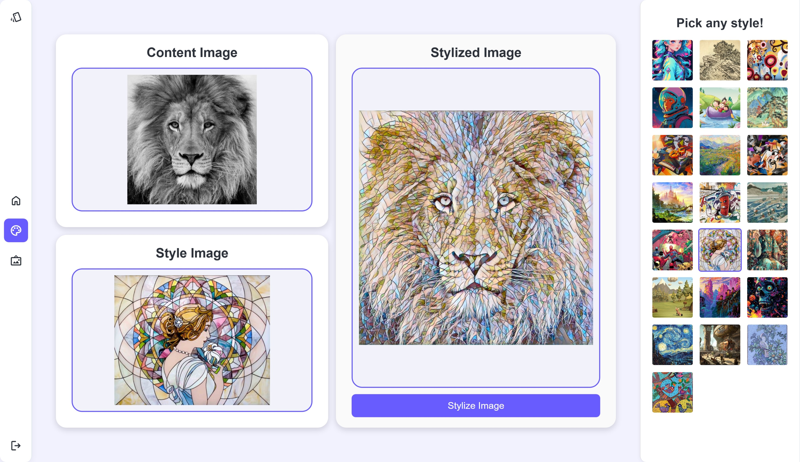

# MDS13-NST-Application

## 📌Introduction



Welcome to Team MDS13's Neural Style Transfer Application, our Final Year Project (FYP) from Monash University Malaysia (**Unit Code**: FIT3162/4, **Batch**: Year 2025, Sem 1)

**Project Group Members:**

| Name | Links |
|------|-------|
| Eldrick Yoong | [GitHub](https://github.com/eldrickyoong) · [LinkedIn](https://www.linkedin.com/in/eldrick-yoong-81599328a/) |
| Andy Lee | [GitHub](https://github.com/AndyIsHigh0608) · [LinkedIn](https://www.linkedin.com/in/andy-lee-405b5926a/) |
| Brittany Lau | [GitHub](https://github.com/brittany0111) · [LinkedIn](https://www.linkedin.com/in/brittany-lau-b44966281/) |

**Project Supervisor:**
Dr. Lim Jit Yan | [Monash Academic Staff Profile](https://www.monash.edu.my/IT/staff/academic/dr-lim-jit-yan)

---

While neural style transfer (NST) has been extensively researched for years, most implementations stay locked inside academic papers, Jupyter notebooks, or require advanced technical knowledge to run. User-friendly, free, and accessible NST interfaces are surprisingly rare, which is the gap this project aims to bridge.

This web application provides an intuitive interface where users can turn their photos into artwork in just a few clicks, powered by two complementary deep learning models under the hood.

---

## 🔗 Additional GitHub Repository

Before we start, note that since this repository contains the *full* backend logic and model weights, a second simplified repository is provided:

👉 [Link to Lightweight Repository's GitHub Page](https://eldrickyoong.github.io/nst-application-onnx/)
👉 [Link to Lightweight Repository](https://github.com/eldrickyoong/nst-application-onnx)

 

This alternative lightweight repository contains a trimmed, static-only implementation that **runs directly on GitHub Pages**, allowing anyone to try style transfer online without installing anything.

---

## 🖼️ Application Overview

> [!NOTE]
> This repository contains code that are designed to be run *locally*, hence the authenticaiton and gallery system serves as a **proof-of-concept only**. Efforts have been made by the team to deploy this application onto cloud, but in this repository, these features simply demonstrate how the system *would* work in a full production deployment.

Below is a quick tour of the mian pages and what each does.

### 🏠 Homepage


- Users can **sign up** or **log in** (again: non-persistent mock accounts).
- The idea is to allow users to manage their artworks under one account once deployed properly

### 🎨 Styling Page


This is the core of the application.

Users can:

- Upload a **content image**
- Choose form **predefined artistic styles**, *or*
- Upload their **own custom style image**

The application then generates a stylized output using the appropriate model.

### 🖼️ Gallery Page


A placeholder repository for previously generated images.
When deployed with a backend + database, this would allow users to:

- View all past output
- Re-download or delete artwork
- Manage their create history

## 🧠 How the Models Work

This project integrate *two* neural style transfer architectures.

### 1. Johnson Style Transfer Model

👉 [Link to original paper](https://arxiv.org/pdf/1603.08155), by Johnson et al.

Used when a user selectes one of the **predefined styles**.

- Each style has its **own set of weight binaries**
- Produced **high-quality,** specialized stylization
- Relative faster inference
- Limitation: *cannot stylize arbritrary user-uploaded style images*

### 2. Linear Transformation Network

👉 [Link to original paper](https://openaccess.thecvf.com/content_CVPR_2019/papers/Li_Learning_Linear_Transformations_for_Fast_Image_and_Video_Style_Transfer_CVPR_2019_paper.pdf), by Li et al.

Used when a user uploads a **custom style image.**

- Can stylize **any** uploaded style
- Trade-offs:
  - Results are generally **less crisp** than Johnson
  - Inference time is **longer** because the architecture has more computational steps

### Why Use Two Models?

In essence, to balance between quality (Johnson) and Flexibility (Linear Transformation Network), such that:

- **Johnson**: High visual quality, but fixed to specific styles
- **Linear Transformation Netowrk**: Works with any style, but slower and slighly lower quality

---

## ⚙️ Installation & Setup

### 1. Clone the Repository

```powershell
git clone https://github.com/eldrickyoong/MDS13-NST-Application.git
cd MDS13-NST-Application
```

### 2. Create a Virtual Environment

```powershell
python -m venv venv
source venv/bin/activate   # macOS / Linux
venv\Scripts\activate      # Windows
```

*(Optional but highly recommended to prevent dependency conflicts.)*

### 3. Install Dependencies

All required packages are listed in `requirements.txt`

```powershell
pip install -r requirements.txt
```

### 4. Download Model Weights

The application requires both Johnson-style and Linear-style weights to function.

1. Vist the [release page](https://github.com/eldrickyoong/MDS13-NST-Application/releases/tag/v1.0.0).
2. Download the `weights.zip` file.
3. Unzip and place the **contents** into: `stylizer/style_engine/backends/weights`.

The resulting folder structure should look like this:

```powershell
MDS13-NST-Application/
└── stylizer/
    └── style_engine/
        └── backends/
            └── weights/
                ├── anime.pth
                ├── candy.pth
                ├── ...
                └── vgg_r41.pth
```

### 5. Run the Application

Inside the main Django project directory:

```powershell
cd stylizer
python manage.py runserver
```

The server will start at: `http://127.0.0.1:8000/`

You can now access the homepage, upload images, test predefined styles, and experiment with custom style uploads.

### Notes

#### Python Version

This project was developed and test on **Python 3.13.5**.

#### GPU Acceleration

If CUDA is installed, PyTorch should automatically accelerate inference. Note that CPU-only users can still run the project (just slower).

---

## 📂 Project Structure

Below is the primary layout of the Neural Style Transfer Application. Each major folder is explained to help readers (and future contributors) quickly understand how the system works. Note that some files/folders are intentionally omitted if deemed irrelevant for the sake of visual clarity.

```powershell
MDS-13-Application/
└── stylizer/
    ├── config/                      # Django project configuration
    │   ├── asgi.py
    │   ├── settings.py              # Installed apps, media paths, static config
    │   ├── urls.py                  # Root URL routes
    │   └── wsgi.py
    │
    ├── manage.py                    # Django management entry point
    │
    ├── media/
    │   └── user_gallery/            # Stores user-uploaded and stylized images
    │       ├── *.jpg
    │       └── ...
    │
    ├── style_engine/                # Core neural style transfer logic
    │   ├── backends/
    │   │   ├── johnson_fast/        # Contains the core modules needed for inference
    │   │   │   └── transformer_net.py
    │   │   │
    │   │   ├── linear_style/        # Contains the core modules needed for inference
    │   │   │   ├── Matrix.py
    │   │   │   └── models.py
    │   │   │
    │   │   └── weights/             # All model binaries (.pth files)
    │   │       ├── johnson/         # Predefined-style weights
    │   │       │   ├── anime.pth
    │   │       │   ├── bw_drawing.pth
    │   │       │   ├── ...
    │   │       │   └── tribal_art.pth
    │   │       │
    │   │       └── linear/          # Linear-style (custom style) weights
    │   │           ├── dec_r41.pth
    │   │           ├── r41.pth
    │   │           └── vgg_r41.pth
    │   │
    │   ├── base.py                  # Shared helper class used by both models
    │   ├── johnson.py               # Johnson Fast Style Implementation
    │   └── linear.py                # Linear Transformation Network Implementation
    │
    └── transfer/                    # Main Django application (UI + routing)
        │
        ├── static/                  # Frontend static files
        │   ├── css/
        │   ├── icons/
        │   ├── images/
        │   │   ├── content-images/         # Placeholder/sample content images
        │   │   └── johnson_fast_style/     # Thumbnails for predefined styles
        │   │       ├── anime.jpg
        │   │       ├── bw_drawing.jpg
        │   │       ├── ...
        │   │       └── tribal_art.jpg
        │   │
        │   └── js/
        │       ├── gallery.js              # JS logic for gallery page
        │       └── script.js               # Main JS for upload + styling UI
        │
        ├── templates/
        │   ├── create.html                 # Styling page - content + style upload
        │   ├── gallery.html                # Image history page
        │   └── index.html                  # Homepage (login / signup proof-of-concept)
        │
        ├── urls.py                         # App-level routing
        ├── utils.py                        # Utility functions (image stylization)
        └── views.py                        # Core Django view logic (UI -> model pipeline)
```

## 📝 Acknowledgements

The development of this project was made possible through the contributions of the open-source community and prior research in neural style transfer. The following repositories and authors provided essential reference implementations that significantly informed and supported the model integration in this work:

- [Linear Transformation Network - PyTorch Implementation](https://github.com/sunshineatnoon/LinearStyleTransfer) by [sunshineatnoon](https://github.com/sunshineatnoon). This implementation served as the primary reference for integrating the Linear Transformation Network architecture used for custom, user-uploaded style images.
- [Johnson Fast Style Transfer - PyTorch Implementation](https://github.com/gordicaleksa/pytorch-neural-style-transfer-johnson) by [gordicaleksa](https://github.com/gordicaleksa). This repository informed the structure and deployment of multiple predefined style models based on the Johnson architecture.
